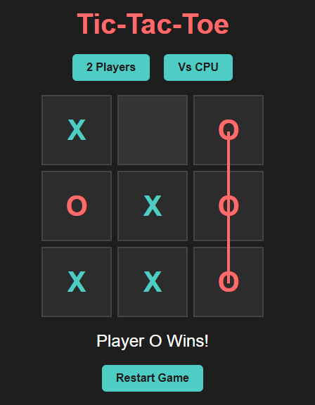

# 🕹️ Tic-Tac-Toe Game

A modern and responsive **Tic-Tac-Toe** game built using **HTML**, **CSS**, and **JavaScript** with two game modes:

✅ **2 Player Mode** – Play with a friend  
✅ **VS CPU Mode** – Play against the computer (random AI)  
✅ **Stylish UI** – Clean design with animations and hover effects  
✅ **Winning Line Animation** – Highlights winning moves with a line  

---

## 🚀 **Features**
✔️ Modern UI with CSS Grid and Flexbox  
✔️ Responsive design for desktop and mobile  
✔️ Dynamic player switching  
✔️ CPU AI for single-player mode  
✔️ Winning animation using transform and rotate  
✔️ Clean and well-structured code  

---

## 🏆 **How to Run**
1. **Clone the repository**:
```bash
git clone https://github.com/askat15109/tic-tac-toe.git
